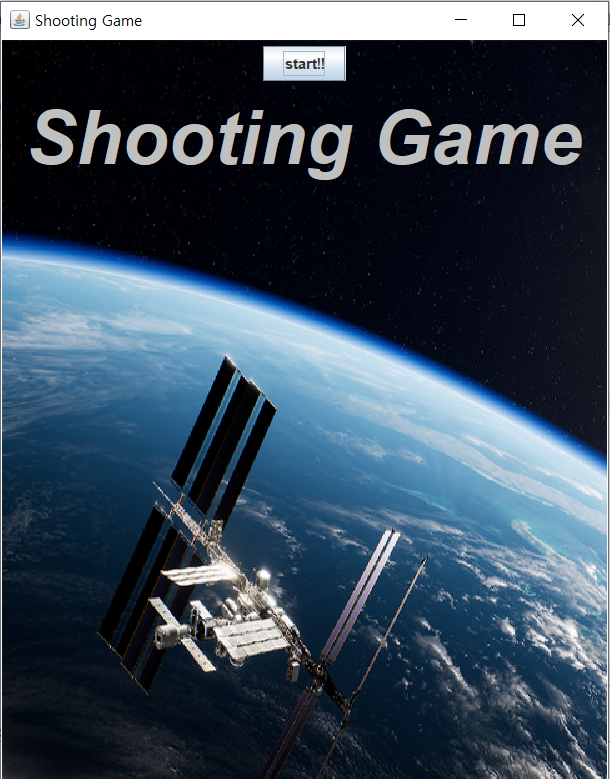
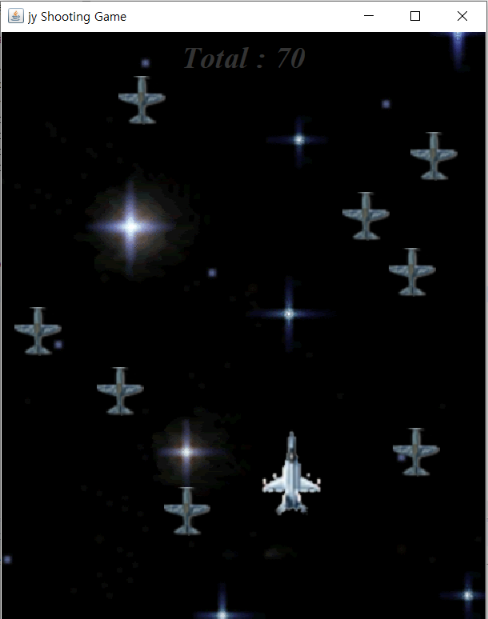
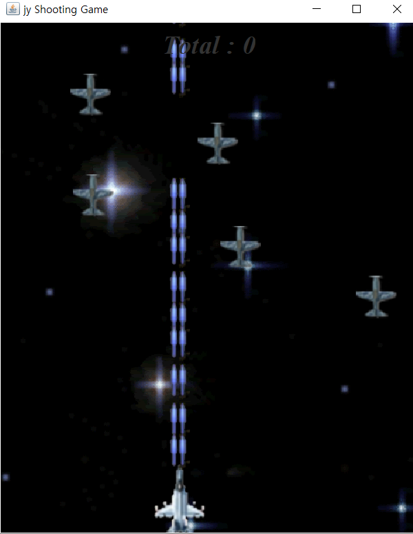
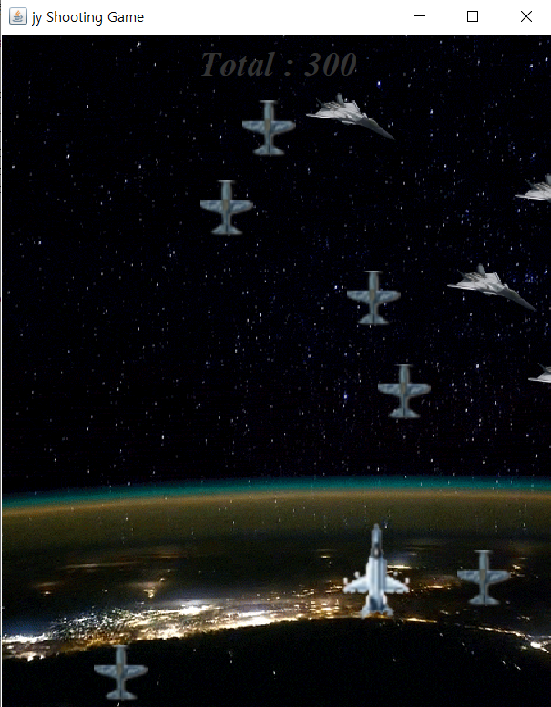
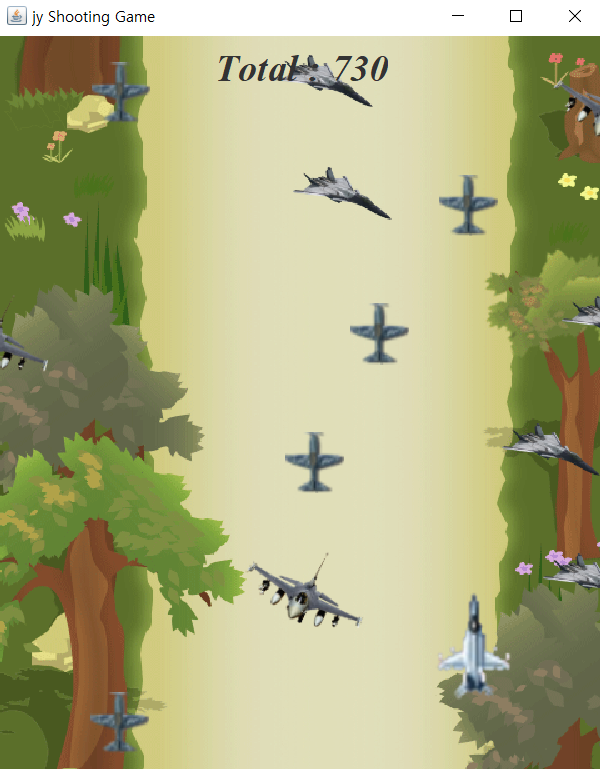
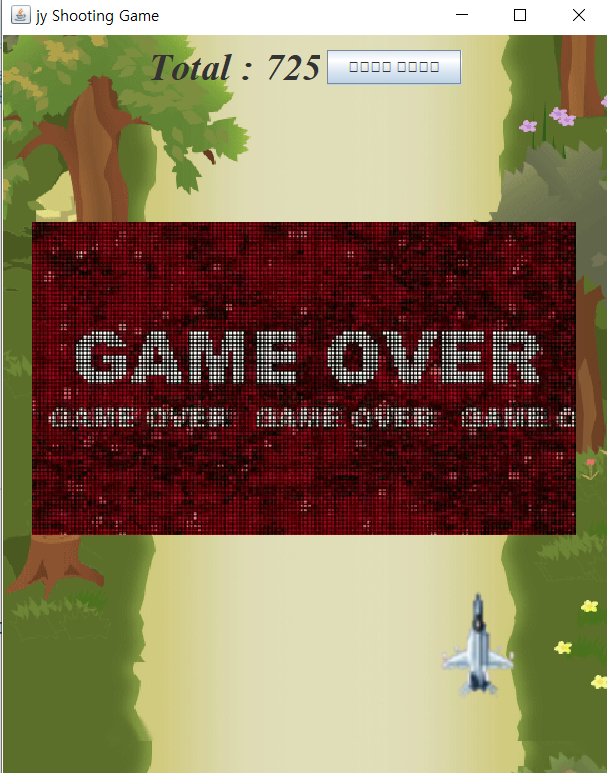

# Shooting-Game
java project(2018.09-2018.12)

## 게임 설명
>> 본 게임은 슈팅게임으로, 점수에 따라 레벨 3까지 진행된다. 키보드로(상하좌우) 움직일 수 있으며 생명은 3개이다. 적과 부딪힐 시 생명이 하나씩 줄어들고, 
3초간 일시정지 상태가 된다. 
게임이 종료되면 본인 정보를 간단하게 입력할 수 있으며 랭킹에 기록된다.

### 게임화면

#### 시작화면

#### 레벨 1

#### 미사일 발사

#### 레벨 2

#### 레벨 3

#### 게임오버

